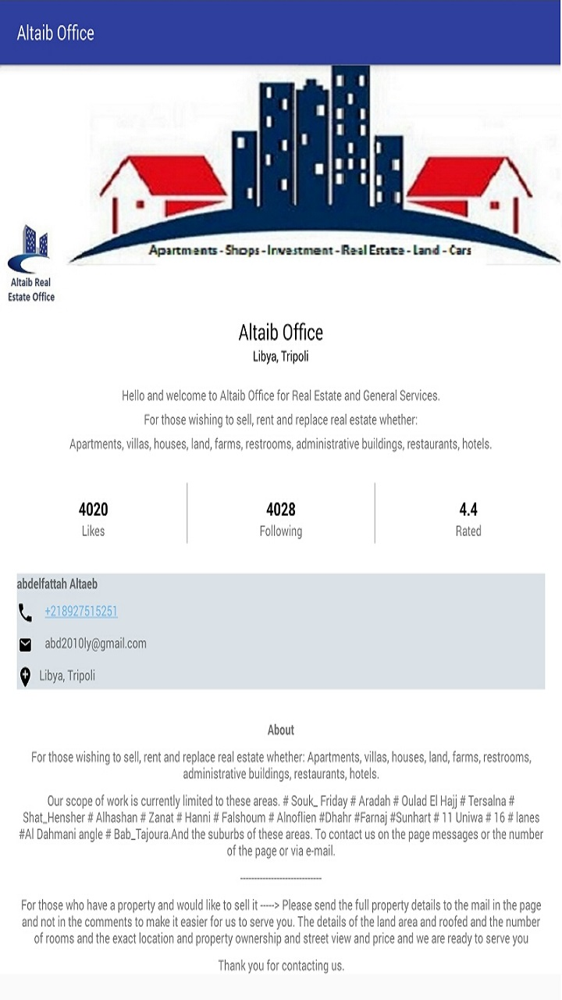

# Altaeb Office App
Project which comes under Udacity Android Basics Nanodegree Program

# Project Overview
Design and implement a single screen app that displays information about a fictional small business.

# Requirement
1. Business name
2. At least one photo representing the business
3. Two or more other pieces of information, such as:
    a) Contact information for the business (eg phone number, email address, website)
    b) Address of the Business
    c) Description of business
    d) Hours of operation

## Final Output - Screenshots

English                         | Arabic
:--------------------------------:|:--------------------------------:
  |

# Download
You can download the apk here [SingleScreenApp](../../raw/master/app/screenshots/app-debug.apk)
